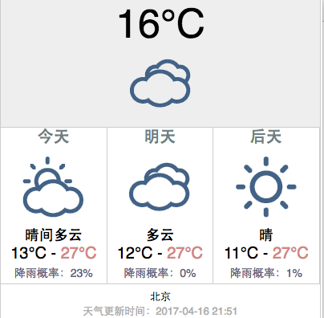

# weather

A Chrome extension for displaying the local weather in China.

"三天"可显示您的地理位置，会自动显示您所在地三天内的的天气状况（温度、降雨概率）

The Chrome extension using [和风天气 API](https://www.heweather.com/documents)

安装: [Chrome 网上应用店]()，或者直接 [下载](https://github.com/timleenights/weather/blob/master/weather.crx)

### 特性

 - 用户所在地 3 天内的天气情况
 - 降雨概率

**截图**

